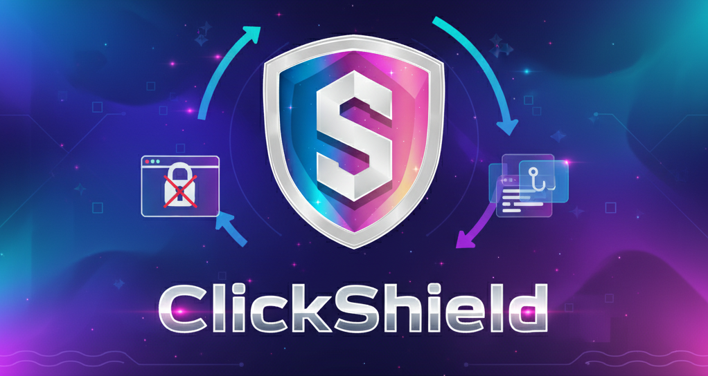

<div align="center">
  
  <p>
    
    
    
    
    
  </p>
  <p>
    <a href="#features"> Features</a>
    &nbsp;•&nbsp;
    <a href="#installation"> Installation</a>
    &nbsp;•&nbsp;
    <a href="#usage"> Usage</a>
    &nbsp;•&nbsp;
    <a href="#contributing"> Contributing</a>
  </p>
</div>

---

##  Overview

ClickShield is a modern, user-friendly web application that helps users identify potentially malicious websites and phishing attempts. Built with React and TypeScript, it leverages Google's Safe Browsing API to provide real-time threat analysis and comprehensive security reports.


##  Features


###  Core Features

-  **Real-time Threat Detection**: Instant analysis using Google's Safe Browsing API
-  **Comprehensive Reports**: Detailed security analysis with threat intelligence
-  **Scan History**: Track and review previous security scans
-  **SSL Verification**: Check website certificate validity
-  **PDF Reports**: Export professional security reports
-  **Dark Mode**: Modern UI with dark/light theme support

###  User Experience

-  **Lightning Fast**: Instant results with optimized performance
-  **Responsive Design**: Works perfectly on all devices
-  **Accessibility**: WCAG compliant with screen reader support


##  Tech Stack


###  Frontend
-  **React 18** - Modern React with hooks and concurrent features
-  **TypeScript** - Type-safe JavaScript development
-  **Vite** - Fast build tool and development server
-  **Tailwind CSS** - Utility-first CSS framework
-  **Framer Motion** - Smooth animations and transitions


###  Backend
-  **Node.js** - JavaScript runtime
-  **Express.js** - Web application framework
-  **Google Safe Browsing API** - Threat intelligence


###  Development Tools
-  **ESLint** - Code linting
-  **Git** - Version control
-  **NPM** - Package management

##  Installation

###  Prerequisites

Before you begin, ensure you have the following installed:
-  **Node.js** (version 18 or higher)
-  **npm** or  **yarn** package manager
-  **Google Safe Browsing API Key**

###  Setup Instructions

1. ** Clone the repository**
  ```bash
  git clone https://github.com/tbhvishal/ClickShield.git
  cd ClickShield
  ```

2. ** Configure environment variables**
  ```bash
  # Copy the example environment file
  cp .env.example .env
  
  # Edit .env and add your Google Safe Browsing API key
  # GOOGLE_SAFE_BROWSING_API_KEY=your_api_key_here
  ```
  
  **Important:** For local development, ensure your `.env` file contains:
  ```env
  GOOGLE_SAFE_BROWSING_API_KEY=your_api_key_here
  VITE_BACKEND_API_URL=http://localhost:8001
  ```
  
  **Note:** Port numbers (8001, 5173) and other non-sensitive configs are defined in `config.ts` at the root.

3. ** Verify your setup (Optional but Recommended)**
  ```bash
  npm run verify
  ```
  *This will check:*
  - ✓ Node.js version (18+)
  - ✓ `.env` file exists and is configured correctly
  - ✓ All required dependencies are installed
  - ✓ Project structure is correct
  
  **If all checks pass ✅, you're ready to go!**

4. ** Start the application in development mode**
  ```bash
  npm start
  ```
  *This will:*
  - Install all dependencies (frontend + backend)
  - Build the project
  - Start backend server on `http://localhost:8001`
  - Start frontend dev server on `http://localhost:5173`
  - Open your browser automatically

---

##  Production & Cloud Deployment

###  Environment Configuration

**For Local Development (`.env`):**
```env
GOOGLE_SAFE_BROWSING_API_KEY=your_api_key_here
VITE_BACKEND_API_URL=http://localhost:8001  # Important: Must be set for local dev
```

**Configuration File (`config.ts`):**
- Port numbers (8001, 5173) and other non-sensitive settings
- Committed to version control
- Easy to modify without touching `.env`

**For Production/Vercel (Vercel Dashboard):**
- Set `GOOGLE_SAFE_BROWSING_API_KEY` in Vercel environment variables
- Leave `VITE_BACKEND_API_URL` empty or unset - production uses relative URLs

###  Deploying to Cloud Providers

1. **Install all dependencies (in CI/CD or cloud build step):**
  ```bash
  npm run install:all
  ```
2. **Build the project for production:**
  ```bash
  npm run build
  ```
  - This builds the frontend (Vite) to `frontend/dist/` and the backend (TypeScript) to `backend/dist/`.
  
3. **Configure environment variables in your cloud provider:**
   - Set `GOOGLE_SAFE_BROWSING_API_KEY` in your cloud dashboard
   - Leave `VITE_BACKEND_API_URL` empty (or don't set it)

4. **Deploy:**
   - ** Vercel**: Use the included `vercel.json` configuration
   - ** Other platforms**: Serve `frontend/dist/` as static files and run backend from `backend/dist/`

**⚠️ Important:** 
- **Never use `npm start` for production** - it's for local development only
- Always use `npm run build` for production builds
- Keep one `.env` file in the root directory for all configurations

###  Google Safe Browsing API Setup

- Visit [Google Cloud Console](https://console.cloud.google.com/)
- Create a new project or select existing one
- Enable the Safe Browsing API
- Create credentials (API Key)
- Add your API key to the root `.env` file:
  ```
  GOOGLE_SAFE_BROWSING_API_KEY=your_api_key_here
  ```

##  Usage

###  Getting Started

1. ** Open your browser** and navigate to `http://localhost:5173`
2. ** Enter a URL** in the input field
3. ** Click "Scan Website"** to analyze
4. ** Review results** and security recommendations

###  How It Works

1. ** URL Submission**: User enters a website URL
2. ** API Query**: Backend queries Google Safe Browsing API
3. ** Analysis**: Advanced threat analysis and classification
4. ** Report Generation**: Comprehensive security report
5. ** PDF Export**: Optional professional PDF report

---

##  Available Scripts

| Command | Description |
|---------|-------------|
| `npm start` | 🚀 Install dependencies, build, and start both servers for local development |
| `npm run verify` | ✅ Verify your setup is configured correctly (recommended before first run) |
| `npm run dev:backend` | 🔧 Start only the backend server in development mode |
| `npm run dev:frontend` | 🎨 Start only the frontend server in development mode |
| `npm run install:all` | 📦 Install dependencies for root, backend, and frontend |
| `npm run build` | 🏗️ Build both frontend and backend for production |
| `npm run build:backend` | 🔨 Build only the backend |
| `npm run build:frontend` | 🎭 Build only the frontend |
| `npm run start:backend` | ▶️ Start the built backend server |
| `npm run start:frontend` | 🌐 Preview the built frontend |
| `npm run clean` | 🧹 Remove all node_modules and dist folders |

**💡 Tip:** Always run `npm run verify` after cloning the repository or changing your `.env` file to ensure everything is configured correctly!

---

##  Project Structure

<details>
<summary>Click to expand project structure</summary>

```
ClickShield/
├── .env                    # ⚠️ Your local environment config (DO NOT COMMIT)
├── .env.example            # Template for .env
├── config.ts               # Non-sensitive configuration (ports, etc.)
├── package.json            # Root package file
├── start.js                # Development startup script
├── verify-setup.js         # Setup verification script
├── README.md               # This file - complete documentation
├── backend/                # Backend Express API
│   ├── src/
│   │   ├── server.ts       # Server entry point
│   │   ├── app.ts          # Express app configuration
│   │   └── api/
│   │       └── checkUrl.ts # URL checking API endpoint
│   └── package.json
└── frontend/               # Frontend React app
    ├── src/
    │   ├── App.tsx         # Main app component
    │   └── components/     # React components
    └── package.json
```

</details>

---

##  Troubleshooting

<details>
<summary>🚫 Blank page or "Cannot connect to server"</summary>

### Symptoms
- Page title and favicon load but content doesn't appear
- Browser console shows connection errors
- Frontend can't reach backend API

### Solution
1. **Check your `.env` file in the root directory**
   ```env
   VITE_BACKEND_API_URL=http://localhost:8001
   ```
   ⚠️ This line **MUST** be set for local development!

2. **Verify both servers are running:**
   ```bash
   # Backend should show:
   ✅ Backend server running on http://localhost:8001
   
   # Frontend should show:
   ➜  Local:   http://localhost:5173/
   ```

3. **If still not working, restart:**
   ```bash
   # Stop all servers (Ctrl+C)
   # Then run:
   npm start
   ```

</details>

<details>
<summary>🔑 "Google Safe Browsing API key not configured" error</summary>

### Solution
1. Get your API key from [Google Cloud Console](https://console.cloud.google.com/)
2. Add it to root `.env` file:
   ```env
   GOOGLE_SAFE_BROWSING_API_KEY=your_actual_key_here
   ```
3. Restart the servers

</details>

<details>
<summary>🌐 Works on Vercel but not locally (or vice versa)</summary>

### Root Cause
Different environment configurations

### Solution

**For Local Development** (`.env`):
```env
GOOGLE_SAFE_BROWSING_API_KEY=your_api_key_here
VITE_BACKEND_API_URL=http://localhost:8001  # ← REQUIRED for local!
```

**For Production/Vercel** (set in Vercel Dashboard):
- `GOOGLE_SAFE_BROWSING_API_KEY=your_api_key_here`
- `VITE_BACKEND_API_URL` should be EMPTY or not set

**Note:** Port numbers (8001, 5173) are defined in `config.ts` - no need to set them in `.env`.

</details>

<details>
<summary>📦 "Module not found" or dependency errors</summary>

### Solution
```bash
# Clean install everything
npm run clean
npm run install:all

# Or manually:
cd backend && npm install
cd ../frontend && npm install
cd ..
npm install
```

</details>

<details>
<summary>🏗️ Build fails or TypeScript errors</summary>

### Solution
```bash
# Clean and rebuild
cd backend && rm -rf dist node_modules
npm install
npm run build

cd ../frontend && rm -rf dist node_modules
npm install
npm run build
```

</details>

<details>
<summary>🔄 Changes not reflecting after update</summary>

### Solution
```bash
# Hard refresh in browser: Ctrl+Shift+R (Windows/Linux) or Cmd+Shift+R (Mac)

# Or clear Vite cache:
cd frontend
rm -rf node_modules/.vite
npm run dev
```

</details>

<details>
<summary>🐳 Docker setup not working</summary>

### Solution
```bash
# Make sure .env exists with proper values
cp .env.example .env
# Edit .env with your API key

# Rebuild containers
docker-compose down
docker-compose up --build
```

</details>

<details>
<summary>✅ Quick verification checks</summary>

### Verify Environment Setup

```bash
# Windows (PowerShell)
Get-Content .env | Select-String "VITE_BACKEND_API_URL"

# Mac/Linux
cat .env | grep VITE_BACKEND_API_URL
```

**Expected output for local dev:**
```
VITE_BACKEND_API_URL=http://localhost:8001
```

### Check if Servers are Running

```bash
# Check backend
curl http://localhost:8001/check-url

# Should return: {"error":"Invalid or missing URL.",...}
```

### Check Frontend can reach Backend

1. Open browser console (F12)
2. Look for this log:
   ```
   VITE_BACKEND_API_URL: http://localhost:8001
   ```
3. If it shows `undefined`, your `.env` is not configured correctly

### Check if Ports are in Use

```bash
# Windows
netstat -ano | findstr :8001
netstat -ano | findstr :5173

# Mac/Linux
lsof -i :8001
lsof -i :5173
```

</details>

<details>
<summary>🆘 Still having issues?</summary>

1. **Check the logs:**
   - Backend logs show in the terminal where you ran `npm start`
   - Frontend logs show in browser console (F12)

2. **Try a different port:**
   Update `config.ts` and `.env`:
   
   **config.ts:**
   ```typescript
   backend: 8002,  // Changed from 8001
   ```
   
   **.env:**
   ```env
   VITE_BACKEND_API_URL=http://localhost:8002
   ```

3. **Check firewall/antivirus:**
   - Allow Node.js through firewall
   - Temporarily disable antivirus to test

4. **Get help:**
   - Check [GitHub Issues](https://github.com/tbhvishal/ClickShield/issues)
   - Create a new issue with:
     - Your OS and Node.js version
     - Full error message
     - Output of `npm start`
     - Your `.env` configuration (without API key)

</details>

---

##  API Reference

For API implementation details (endpoints, request/response shapes and error handling), see `backend/src/api/checkUrl.ts`.

---

##  Contributing

We welcome contributions! Please see our [Contributing Guidelines](CONTRIBUTING.md) for details.

###  How to Contribute

1. ** Fork the repository**
2. ** Create a feature branch**
   ```bash
   git checkout -b feature/amazing-feature
   ```

3.  **Commit your changes**
  ```bash
  git commit -m 'Add amazing feature'
  ```
4.  **Push to the branch**
  ```bash
  git push origin feature/amazing-feature
  ```
5.  **Open a Pull Request**


###  Reporting Issues

-  **Bug Reports**: [GitHub Issues](https://github.com/tbhvishal/ClickShield/issues)
-  **Feature Requests**: [GitHub Issues](https://github.com/tbhvishal/ClickShield/issues)

##  Support


If you find ClickShield helpful, please consider:

- ** Following the developer: [@tbhvishal](https://github.com/tbhvishal))**
- ** Starring** the repository
- ** Sharing** with others
- ** Contributing** to the project


##  License

This project is licensed under the MIT License - see the [LICENSE](LICENSE) file for details.

<div align="center">
  <p><strong>Made with  by Vishal Sharma</strong></p>

  <p>
  <a href="https://github.com/tbhvishal/ClickShield"></a>
  &nbsp;
  <a href="mailto:vishalsharmax@zohomail.in
"></a>
  </p>
</div>

---

<div align="center">
  <p><strong> Stay Safe Online with ClickShield </strong></p>
  <p><em>Advanced threat detection for a safer internet experience</em></p>
</div>
